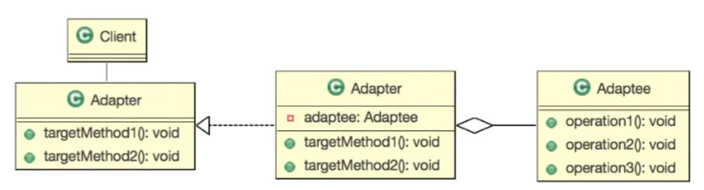

 > 해당 노트는 [자바 디자인 패턴의 이해 - Gof Design Pattern](https://www.inflearn.com/course/%EC%9E%90%EB%B0%94-%EB%94%94%EC%9E%90%EC%9D%B8-%ED%8C%A8%ED%84%B4#curriculum)강의를 듣고 작성한 노트입니다.
 
<aside>
💡 학습목표  <br/>
`알고리즘`을 `요구사항`에  맞춰 사용할 수 있다.
</aside>

### 어댑터 패턴

---

<aside>
💡 어댑터란? 기계,기구 등을 다목적으로 사용하기 위한 `부가기구`
</aside>

- 기본설계



- 이미 주어진 `Adaptee` 알고리즘을, `Adapter` 라는 기능을 통해, 원하는 기능으로 변경하는것

  
---
#### 예제 
두수에 대한 다음 연산을 수행하는 객체를 만들어 주세요  
    - 수의 두배수를 반환 : twiceOf(Float):Float  
    - 수의 반(1/2)의 수를 반환 : halfOf(Float):Float  
    - 구현객체의 이름은 Adapter  
    - Math클래스에서 두배와 절반을 구하는 함수는 이미 구현되어있습니다.  

```java
    // 제공된(이미 구현된) 기능 
    public class Math{
        // 두배
        public static double twoTiome(double num){return num*2;}
    
        // 절반
        public static double half(double num){return num/2};
    
        // 강화된 알고리즘
        public static Double doubled(Double d){return d*2;}
    }
    
    // ---------------------------------------------------
    
    public class AdapterImpl implements Adapter{
    
        @Override
        public Float twiceOf(Float f) {
            return (float)Math.twoTime(f.doubleValue());;
        }
        @Override
        public Float halfOf(Float f){
            return (float)Math.twohalf(f.doubleValue());
        }
    
    }
    // -------------------------------------------------
    public class Main{
    
        public static void main(String[] args){
            
            // 원하는 기능
            // public Float twiceOf(Float f);
            // public Float halfOf(Float f);
    
            Adapter adapter = new AdapterImpl();
        
            System.out.println(adapter.twiceOf(100f));
            System.out.println(adapter.halfOf(100f));
        }
    }
```
    
#### 예제 +
- 알고리즘의 변경을 원한다  
    - Math클래스에 새롭게 두배를 구할 수 있는 함수가 추가되었습니다.  
    - `새로 구현된 알고리즘을 이용`하도록 프로그램을 수정해주세요,  
- 절반을 구하는 기능에서 로그를 찍는 기능을 추가해 주시기 바랍니다. 

```java
// Adapter와 Main클래스를 건들지 않고, 구현체만 수정함으로써, 변경사항을 적용할 수 있다.
public class AdapterImpl implements Adapter{

	@Override
	public Float twiceOf(Float f) {
		return Math.doubled(f.doubleValue()).floatValue();
	}
	@Override
	public Float halfOf(Float f){
		System.out.println("half함수 호출");
		return (float)Math.twohalf(f.doubleValue());
	}

}
```

---
