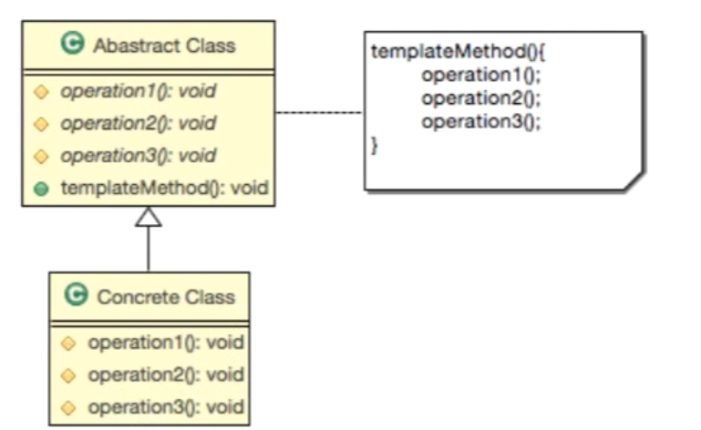

<aside>
💡 학습 목표  
`**일정한 프로세스**` 를 가진 요구사항을 템플릿 메소드 패턴을 이용하여 구현할 수 있다.
⇒ 스텝 메소드 패턴 이란 이름이 더 잘 어울린다고 생각 한다고 함

</aside>

### 템플릿 메소드 패턴

---

- 사전적 의미의 템플릿 ?
    - 모양자 + 컬러펜 → 빨간 동그라미, 파랑 네모
- Template Method Pattern?
    
    > 알고리즘의 `구조를 메소드에 정의` 하고 
    하위 클래스에서 알고리즘 구조의 변경없이
    알고리즘을 `재정의` 하는 패턴
    > 
- 언제사용하는가 ?
    - 구현하려는 알고리즘이 `일정한 프로세스`가 있다. → 여러 단계로 나눌 수 있다
    - 구현하려는 알고리즘이 `변경 가능성`이 있다.
- 어떻게 사용하는가 ?
    - 알고리즘을 `여러단계`로 나눈다
    - 나눠진 알고리즘의 단계를 `메소드로 선언`한다.
    - 알고리즘을 수행할 `템플릿 메소드`를 만든다.
    - 하위 클래스에서 `나눠진 메소드들을 구현`한다.

- 기본설계
    
    
    

#### 예제

- 신작 게임의 접속을 구현해 주세요
    - requesteConnection(String str):String
- 유저가 게임 접속시 다음을 고려해야합니다.
    - 보안 과정 : 보안 관련 부분을 처리합니다.
        - doSecurity(String string):String
    - 인증과정 : user name과 password가 일치하는지 확인합니다.
        - authentication(String id, String password):boolean
    - 권한과정 : 접속자가 유료회원인지 무료회원인지 게임마스터인지 확인합니다.
        - authorization(String userName):int
    - 접속과정 : 접속자에게 커넥션 정보를 넘겨줍니다.
        - connection(String info):String

```java
//
public abstract class AbstGameConnectHelper{
	// 여러 단계로 나눔
	// 이러한 단계가 외부에 노출되면 안됨(자식들은 구현할 수 있게 protected로 선언)
	protected abstract String doSecurity(String string);
	protected abstract boolean authentication(String id, String password);
	protected abstract int authorization(String userName);
	protected abstract String connection(String info);

	//템플릿 메소드
	public String reqeustConnection(String str){
		// 여러 단계로 나누어져있음
		// 1. 보안작업 -> 암호화된 문자열을 복호화
		String decodedInfo = doSecurity(str);
		// 2. 인증과정
		if(!authentication(decodedInfo))
			throw new Error("회원정보 불일치");
		// 3. 권한과정 
		int i = authorization(decodedInfo);
		switch(i){
			case 0 : //게임매니저
				break;
			case 1 : // 유료회원
				break;
			case 2 : // 무료회원
				break;
			default:
				break; 
		}
		// 4. 접속과정
		return connectijon(String info)
	}
	
}

// 구현클래스 작성 ----------------------------------------------------------
public class DefaultGameConnectHelper extends AbstGameConnectHelper{
	
	@Override
	protected String doSecurity(String string){
		System.out.println("디코드");
		return string;
	}
	@Override
	protected boolean authentication(String id, String password){
		System.out.println("아이디/암호 확인 과정");
		return true;
	}
	@Override
	protected abstract int authorization(String userName){
		System.out.println("권한 확인");
		return 0;
	}
	@Override
	protected abstract String connection(String info){
		System.out.println("마지막 접속단계!");
		return info;
	}	
}

// 메인 클래스 -----------------------------------------------
public class Main(){
	public static void main(String[] args){
		AbstGameConnectHelper helper = new DefaultGameConnectHelper();
		helper.requestConnection("아이디 암호 등 접속 정보")
	}
}

```


#### + 추가 변경사항이 생겼을 때!!

<aside>
➡️ 1. 보안부분이 정부 정책에 의해서 강화 되었습니다 .강화된 방식으로 코드를 변경해야 합니다.
2. 여가부에서 밤 10시 이후에 접속이 제한되도록 합니다.

</aside>

- 구현부(DefaultGameConnectHelper)에서
    - doSecurity : 강화된 보안 알고리즘 적용
    - authorization : 권한 확인 시, 청소년 확인하여 10시 이후 접속 제한

---

<br/>
 > 해당 노트는 [자바 디자인 패턴의 이해 - Gof Design Pattern](https://www.inflearn.com/course/%EC%9E%90%EB%B0%94-%EB%94%94%EC%9E%90%EC%9D%B8-%ED%8C%A8%ED%84%B4#curriculum)강의를 듣고 작성한 노트입니다.
 