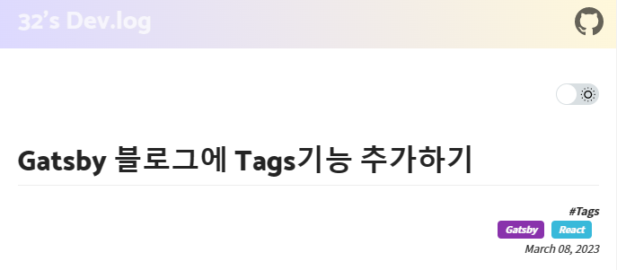
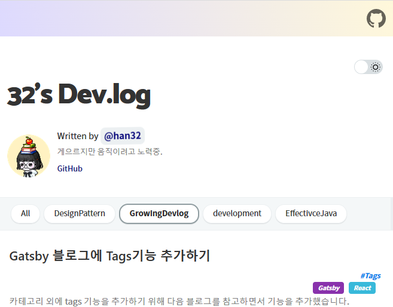

카테고리 외에 tags 기능을 추가하기 위해 다음 블로그를 참고하면서 기능을 추가했습니다.
https://woojeongmin.com/2021/gatsby-blog/1-tags/

내 블로그가 베이스로하고 있는 개츠비 템플릿 [JaeYeopHan/gatsby-starter-bee](https://github.com/JaeYeopHan/gatsby-starter-bee)
에 추가를 해보았는데, 도움이 되실 분이 있을까 해 적용했던 방법을 기록해둡니다.  

React를 제대로 공부한적이 없어서 효율적지 않은 코드일 수 있습니다. 개선점이 있다면 댓글남겨주시면 감사하겠습니다 😅

---

0. 포스팅의 메타데이터에 tags정보로 태그를 표현할 수있습니다
    ```
        ---
        title: 'Gatsby 블로그에 Tags기능 추가하기'
        date: 2023-03-08 19:20
        category: 'GrowingDevlog'
        draft: false
    +    tags:
    +        - Gatsby
    +        - React
        ---

    ```  


1. Tags컴포넌트 생성  
    `src/components` 하위에 `tags`폴더 생성 후 아래 파일 추가   
    * index.jsx 파일 추가
    ```js
        import React from 'react'

        import './index.scss'

        export const Tags = ({ post }) => {
        console.log(post);
        return (
            post.frontmatter.tags ? 
            <div className="tags">
            <ul>
                {post.frontmatter.tags
                ? post.frontmatter.tags.map(tag => (
                    <li key={tag}>
                    <b className={'tag_' + tag}>{tag}</b>
                    </li>
                ))
                : null}
            </ul>
            </div> 
            : <></>
        )
        }
    ```

    * index.scss 추가
    ```scss
        @import '../../styles/variables.scss';
        .tags {
        text-align: right;
        font-size: 12px;
        font-style: italic;
        }

        .tags ul {
        list-style: none;
        margin: 0;
        }

        .tags ul li {
        display: inline-block;
        margin-right: 0.5rem;
        text-align: center;
        }

        .tags ul li b {
        display: block;
        padding-left: 0.5rem;
        padding-right: 0.5rem;
        padding-top: 0.1rem;
        padding-bottom: 0.1rem;
        text-decoration: none;
        color: rgb(255, 255, 255);
        font-size: 0.65rem;
        border-width: 4px;
        border-radius: 0.25rem;
        background-color: #a1a1a1;
        }

        .tags ul li b:hover {
        background-color: #d6c5a3;
        }
        // 태그 이름으로 별도 컬러 지정
        .tag_Gatsby {
        background-color: #8932ac !important;
        color: white !important;
        }
        .tag_React {
        background-color: #38b9da !important;
        color: white !important;
        }
    ```


2. 게시글(자세히보기)내에 태그 추가
    * blog-post.js 파일에 tags 정보 추가
    1. Tags 컴포넌트 추가
    2. graphql에 추가
    ```js
        // Tags 컴포넌트 추가
        +import { Tags } from '../components/tags'
        ...
        export default ({ data, pageContext, location }) => {
        ...
        // 생략

        return (
            <Layout location={location} title={title}>
            <Head title={postTitle} description={post.excerpt} />

            <PostTitle title={postTitle} />

            <PostDate date={date} />
            <PostContainer html={post.html} />
            <!-- Tags를 표시하고 싶은 위치에 Tag 컴포넌트 추가 -->
        +   <h4>#tag</h4>
        +   <Tags post={post} />
            {!!sponsor.buyMeACoffeeId && (
                <SponsorButton sponsorId={sponsor.buyMeACoffeeId} />
            )}
            <Elements.Hr />
            <Bio />
            
            ...
            </Layout>
        )
        }

        //2. graphql 에도 tags를 파싱해 오도록 추가
        export const pageQuery = graphql`
        query BlogPostBySlug($slug: String!) {
            site {
            siteMetadata {
                title
                author
                siteUrl
                comment {
                disqusShortName
                utterances
                }
                sponsor {
                buyMeACoffeeId
                }
            }
            }
            markdownRemark(fields: { slug: { eq: $slug } }) {
            id
            excerpt(pruneLength: 280)
            html
            frontmatter {
                title
                date(formatString: "MMMM DD, YYYY")
         +      tags
            }
            }
        }
        `
    ```
    
    * 결과    

        
         ~~css 수정은 나중에 ..~~


3. 메인페이지(Thumbnail Post)화면에 태그 추가
    * gatsby-node.js의 graphql에 tags추가
    ```js
    ...
    return graphql(
        `
        {
            allMarkdownRemark(
            filter: { frontmatter: { category: { ne: null }, draft: { eq: false } } }
            sort: { fields: [frontmatter___date], order: DESC }
            limit: 1000
            ) {
            edges {
                node {
                fields {
                    slug
                }
                frontmatter {
                    title
                    category
        +           tags
                }
                }
                previous {
                fields {
                    slug
                }
                frontmatter {
                    title
    ```

    * `thumbnail-item/index.jsx`에 Tags추가
    ```js
            import React from 'react'
            import { Link } from 'gatsby'
            import { TARGET_CLASS } from '../../utils/visible'
        +   import { Tags } from '../tags'

            import './index.scss'

            export const ThumbnailItem = ({ node }) => (
            <Link className={`thumbnail ${TARGET_CLASS}`} to={node.fields.slug}>
                <div key={node.fields.slug}>
                <h3>{node.frontmatter.title || node.fields.slug}</h3>
        +       <Tags post={node} />
                <p dangerouslySetInnerHTML={{ __html: node.excerpt }} />
                </div>
            </Link>
            )
    ```

    * 결과
        

