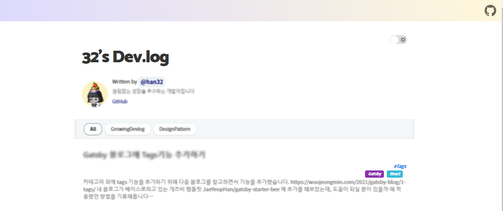
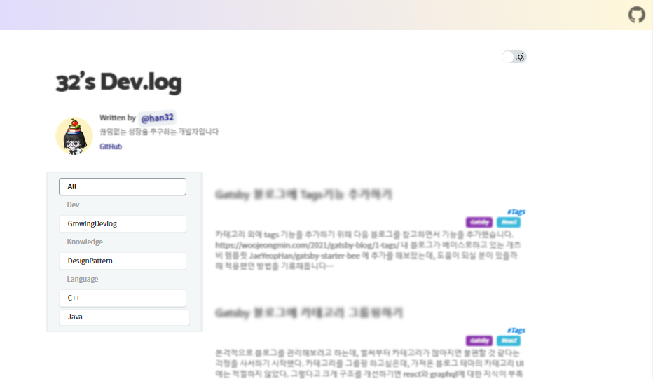
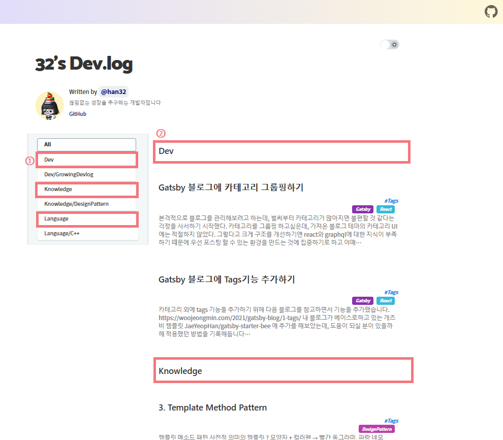
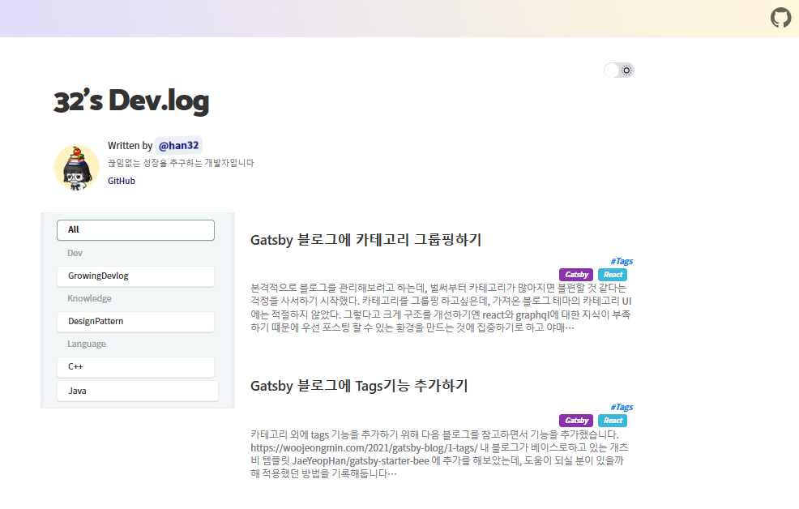

본격적으로 블로그를 관리해보려고 하는데, 벌써부터 카테고리가 많아지면 불편할 것 같다는 걱정을 사서하기 시작했다.  
카테고리를 그룹핑 하고싶은데, 가져온 블로그 테마의 카테고리 UI에는 적절하지 않았다.
그렇다고 크게 구조를 개선하기엔 react와 graphql에 대한 지식이 부족하기 떄문에 우선 포스팅 할 수 있는 환경을 만드는 것에 집중하기로 하고 ~~야매~~로 해보기로 했다.  
(리액트와 graphql을 차차 .. 공부해보도록 하쟈ㅎㅎ)

<aside>
아이디어 💡 카테고리를 '/'로 구분지어 상위 카테고리를 만들어 주자!
</aside>

### as-is 카테고리
 

### to-be 카테고리  



----
### 소스 수정
#### 1. CSS로 대강 위치를 잡아줌  

  - 카테고리(sidebar 왼쪽으로 이동) `src\components\category\index.scss`

    ```scss
        .sidebar {
    +    position: fixed;
    +    display: block;
        }

        .category-container {
            position: sticky;
            position: -webkit-sticky;
            top: 0;
            line-height: 0;
            white-space: nowrap;
            overflow-x: scroll;
            -ms-overflow-style: none; // IE 10+
            overflow: -moz-scrollbars-none; // Firefox
            z-index: 1;
            padding: 6px 20px;
    +       width: 300px;           
    +       list-style: none;

            .item {
    +           // display: inline-block; -- 가로로 나열하던 부분 주석
                margin: 0.25rem 6px 0.25rem 0;
                border-radius: 5px;
                white-space: normal;
                box-sizing: border-box;
                cursor: pointer;

                div {
                display: block;
                padding: 14px 16px 16px 16px;
                font-size: 13px;
                box-sizing: border-box;
                }
            }
            // ...
        }

    ```

  * 썸네일 컨테이너 우측으로 밀기 `src\components\thumbnail-container\index.scss`
    ```scss
        .thumbnail-container {
        min-height: calc(100vh - 3.5rem);
    +   padding-left: 300px;
        }
    ```


#### 2. 기존 게시글 카테고리를 상위 카테고리를 지정해서 구조화 시켜 post 업데이트 
  * 카테고리 구상안
    ```
    Dev/GrowingDevlog
    Lanaguage/Java
    Lanaguage/C++
    Knowledge/DesignPattern
    ...
    ```
  * post 업데이트 예시  

    ```
        ---
        title: '2. Adapter Pattern'
        date: 2022-09-22 00:00:00
        category: 'Knowledge/DesignPattern' // <-- 카테고리 구조화
        draft: false
        tags: 
        - DesignPattern
        ---
    ```
  * 카테고리 그룹 구분용 포스트 추가
    ```
        blog
        └ CategoryDivider
            └ dev.md
            └ knowledge.md
            └ language.md
    ```

#### 3. 카테고리 정렬 추가하기   
  - 카테고리 이름순으로 정렬하기 `src\pages\index.js`  

    ```javscript
    // 카테고리, 게시글 정렬 
    export const pageQuery = graphql`
    query {
        //...
        allMarkdownRemark(
    +   sort: { fields: [frontmatter___category, frontmatter___date], order:[ASC, DESC] }
        filter: { frontmatter: { category: { ne: null }, draft: { eq: false } } }
        ) {
        // ...
        }
    }
    `
    ```

### 중간점검
 

 (1) 사이드바 수정
    - 하위 카테고리에서 카테고리 그룹 안보이게 하기
    - 카테고리 그룹 사이드 바에서 선택 안되도록 막기, CSS 변경하기
 (2) 왼쪽 포스트 목록(thumbnail)에서 카테고리 그룹용 post 숨기기


#### 4. 사이드 바 수정
  * 하위 카테고리에서 그룹 안보이게 하기
  * 카테고리 그룹 클릭 했을 때, 동작 안하게 처리
  * `src\components\category\index.jsx`
    ```jsx
    // ...
      return (
        <div className="sidebar">
            <ul
              ref={containerRef}
              className="category-container"
              role="tablist"
              id="category"
              style={{
                margin: `0 -${rhythm(3 / 4)}`,
              }}
            >
              <Item title={'All'} selectedCategory={category} onClick={selectCategory} scrollToCenter={scrollToCenter} />
        +        {categories.map((title, idx) => {
        +          let cArr = title.split('/');           // '/'로 구분하여 카테고리 그룹인지, 카테고리인지 판단
        +          if (cArr.length == 1) {
        +            return (
        +              <Item
        +                key={idx}
        +                title={title}
        +                selectedCategory={category}
        +                onClick={selectCategory}
        +                scrollToCenter={scrollToCenter}
        +                disable={true}                   // 동작 처리하기 위한 플래그 변수 추가
        +              />
        +            )
        +          } else {
        +            return (
        +              <Item
        +                key={idx}
        +                title={title}
        +                selectedCategory={category}
        +                onClick={selectCategory}
        +                scrollToCenter={scrollToCenter}
        +                disable={false}
        +              />
        +            )
        +          }
        +        })}
            </ul>
          </div>
        )
      }
    ```
  * `src\components\category\item\index.jsx`
    ```jsx
    + export const Item = ({ title, selectedCategory, onClick, scrollToCenter, disable }) => {  // 전달받은 disable 플래그로 처리
        const tabRef = useRef(null)

        const handleClick = useCallback(() => {
          scrollToCenter(tabRef)
          onClick(title)
        }, [tabRef])

        useEffect(() => {
          if (selectedCategory === title) {
            scrollToCenter(tabRef)
          }
        }, [selectedCategory, tabRef])

    +   let showTitle = title.split("/").pop();     // '/'로 구분한 문자열중 마지막 title 사용
        return (
          <li
            ref={tabRef}
    +       className={disable != true ? "item" : "item_group"}   // 카테고리 그룹과 css 다르게 적용
            role="tab"
            aria-selected={selectedCategory === title ? 'true' : 'false'}
          >
    +       <div onClick={disable != true ? handleClick : null}>{showTitle}</div>   // 클릭 동작 제거
          </li>
        )
    ```

  * 카테고리 그룹 css 변경하기
    * `src\components\category\index.scss`
      ```scss
      +    .item_group {
      +    margin: 0.25rem 6px 0.25rem 0;
      +    white-space: normal;
      +    box-sizing: border-box;
      +    color: #a5a5a5;
      +    div {
      +      display: block;
      +      padding: 14px 16px 16px 16px;
      +      font-size: 13px;
      +      box-sizing: border-box;
      +    }
      +  }
      ```

#### 5. 포스트 목록(thumbnail)에서 카테고리 그룹용 포스트 숨기기
  * `src\components\contents\index.jsx`
    ```jsx
    // ...
      const refinedPosts = useMemo(() =>
      posts
        .filter(
          ({ node }) =>
    +       node.frontmatter.category.split("/").length > 1 && (
              category === CATEGORY_TYPE.ALL ||
              node.frontmatter.category === category)
        )
        .slice(0, count * countOfInitialPost)
    )
    // ...
    ```


#### 완성!



#### + 추가작업
1. thnumbnail context 정렬
2. 이전글 보기/다음글 보기에 카테고리 그룹 노출

#### 1. thnumbnail context 정렬
  * category 순으로 우선 정렬되어, `All` 탭일 경우, 시간순으로 보이지 않음
  * `src\components\thumbnail-container\index.jsx` 파일 다음과 같이 수정
    ```jsx
    import React from 'react'

    import './index.scss'

    export const ThumbnailContainer = React.memo(({ children }) => {
      // children을 복사하여 배열로 만들기
      const childrenArray = React.Children.toArray(children);

      // 날짜 속성을 기준으로 정렬
      childrenArray.sort((a, b) => {
      // 날짜 속성을 비교하여 정렬
        const dateA = new Date(a.props.node.frontmatter.date);
        const dateB = new Date(b.props.node.frontmatter.date);
        return dateB - dateA ; // 내림차순
      });
      return <div className="thumbnail-container">{childrenArray}</div>;
    });
    ```


#### 2. 이전글 보기/다음글 보기에 카테고리 그룹 노출
1. previous, next 정보에 category 추가하기 (카테고리 그룹 판단용)
  - `gatsby-node.js`
    ```javascript
              previous {
                fields {
                  slug
                }
                frontmatter {
                  title
    +             category
                }
              }
              next {
                fields {
                  slug
                }
                frontmatter {
                  title
    +             category
                }
              }
    ```

2. 조건에 따라 버튼 숨기기
  - `\components\post-navigator\index.jsx`
    ```jsx
        const { previous, next } = pageContext

      + let hasPrev = previous && previous.frontmatter.category && previous.frontmatter.category.split('/').length > 1;
      + let hasNext = next && next.frontmatter.category && next.frontmatter.category.split('/').length > 1;

        return (
          <ul className="navigator">
            <li>
      +       {hasPrev && (
                <Link to={previous.fields.slug} rel="prev">
                  ← {previous.frontmatter.title}
                </Link>
              )}
            </li>
            <li>
      +       {hasNext && (
                <Link to={next.fields.slug} rel="next">
                  {next.frontmatter.title} →
                </Link>
              )}
    ```

#### 남겨진 과제
  1. 반응형 UI
  2. 이름순이 아닌 정렬