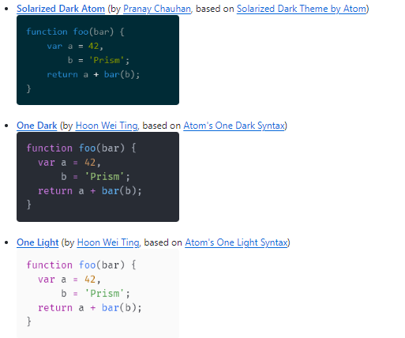
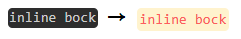

<aside>
<a href="https://github.com/JaeYeopHan">@Jbee</a> 님의 블로그 템플릿을 받아서 사용 중 인데, 코드블록 디자인에 몇가지 설정을 추가하고 싶었다.  <br/>
<b>1. 테마</b> <br/>
2. 타이틀 <br/>
2. 라인넘버 <br/>
3. 하이라이트  <br/>
</aside>

> `gatsby-remark-highlight-code`를 사용하고 싶었으나, 적용중인 테마에선 `prismjs`를 사용하고 있었고, 이것저것 시도하다가 결국 `prismjs`을 사용하기로..

## 코드블록 테마 바꾸기
우선 `prismjs`플러그인을 설치한다. (사용중인 블로그 템플릿엔 package.json에 이미 있음)
```bash
npm install gatsby-remark-prismjs prismjs
```

테마를 적용할 두가지 방법을 고려했다

> 1. 수동으로 prismjs CSS 바꾸기
> 2. prismjs 공식 테마 import하기  

### 1. 수동으로 CSS 바꾸기
[prism-themes](https://github.com/PrismJS/prism-themes?tab=readme-ov-file)
* 이 블로그에서 사용하고 있는 템플릿의 기본 코드블록 스타일은 `prismjs`를 기반으로 하고있고 `styles/code.scss`파일에서 커스텀 설정을 하고있다.  
* `styles/code.scss` 파일에 있는 css를 지우고 위 링크에서 맘에드는 테마를 골라 ctrl C V한다.
* 공식 테마보다 종류가 많다!  
  

### 2.prismjs 공식 테마 import하기
[prismjs.com](https://prismjs.com) 
* prismjs 홈페이지에서 공식 테마를 확인해 볼 수 있다.
* `styles/code.scss`의 스타일을 지우고, `gatsby-browser.js`에 원하는 테마의 css파일을 적용해준다

  ```js:title=gatsby-browser.js
  // custom typefaces
  // polyfill
  require('intersection-observer')
  require("prismjs/themes/prism-tomorrow.css")    // highlight-line
  ```

  > 나는 prismjs 공식 테마를 적용하고 추가적인 커스텀 사항들은 `styles/code.scss`에 추가하여 적용하였다.

* 코드블록 테두리도 둥글게 만들어주고 ~
  ```css:title=styles/code.scss
  /* code block*/
  pre[class*="language-"] {
    border-radius: .5em;
  }
  ```

* 다크테마를 적용했더니 `inline bock`이 어둡게 잡히는게 싫어서 아래 css를 추가했다.

  ```css:title=styles/code.scss
  /* Inline code */
  :not(pre)>code[class*="language-"] {
    padding: .2em;
    border-radius: .3em;
    white-space: normal;
    background: #fff3ce;
    color: #ff5c5c;
  }
  ```