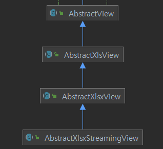

### Apache POI Library

Java 코드 상에서 Excel 파일을 생성해주는 library입니다.

해당 library를 쓰다보면 엑셀 생성의 핵심인 Workbook을 생성하게 됩는데, Workbook 종류는 3가지가 있습니다.

1. **HSSF Workbook** 
2. **XSSF Workbook**
3. **SXSSF Workbook**

### Workbook 비교

- 생성할 데이터에 따라 적절한 WorkBook을 선택해서 개발하면 됩니다

|  | HSSF | XSSF | SXSSF |
| --- | --- | --- | --- |
| 버전,호환성 | excel 97 ~ 2003 버전 | excel 2007 이상의 버전 | POI 3.8 beta3 버전부터 지원하는 성능개선 버전 |
| AbstractView 구현체 | AbstractXlsView | AbstractXlsxView  | AbstractXlsxStreamingView  |
| 확장자 | .xls  | .xlsx (1,048,576행) | .xlsx (1,048,576행) |
| 속도 | 빠름 | 느림 | 빠름 |
| 특징 |  | - XML 기반으로, 메모리 사용 공간이 HSSF 보다 높음 | - 대용량 sheet 생성 시 사용 |
| 제한 사항 | row수 제한 : 65,535 (이후 row 생성 시 에러 발생) | row수 제한 없음 | - row수 제한 없음(단, flushRows 필요)  - 쓰기 전용이라 기존 엑셀 읽지 못함  - Sheet.clone()은 지원되지 않는다  - excel 기능중 하나인 'Formula evaluation'는 지원 되지 않는다. |

<aside>
💡 현재 참여중인 솔루션에선 XSSF을 사용하고 있는데, 엑셀로 통계를 보고싶어 하는 고객 요구사항이 많이 추가적으로 들어오기도 하고 대용량 데이터를 반출하는 경우 속도이슈가 있어, SXSSF 방식으로 전환해 볼까 한다.
</aside>

### Apache POI, AbstractView를 사용해서 Excel 다운로드가 이루어지는 과정

1. **클라이언트 요청**
2. **Controller 처리**: 요청을 처리하는 Controller 메서드가 실행되고 서비스 로직을 처리 후 엑셀로 생성할 데이터를 모델에 추가하고 **`ModelAndView`**를 반환.
3. **ViewResolver 동작 (AbstractView)** 
4. **AbstractView 확장한 추상클래스 구현체에서 rendering** : 엑셀 파일 생성하고 응답 스트림에 작성 
5. **브라우저에서 다운로드**

<aside>
❓ 어떻게 View를 반환하는 것으로 엑셀파일을 다운로드 시켜주는 걸까?

</aside>

### AbstractView ?

- `AbstractView`는 Spring MVC에서 특정한 뷰를 생성하는 데 사용되는 추상 클래스입니다.
- 이 클래스는 클라이언트 요청에 대한 응답으로 **특정 형식의 출력**을 생성하는 방법을 정의합니다.
- `AbstractView`의 서브클래스 중 하나인 `AbstractXlsxView`는 Excel 파일을 생성하는 데 사용됩니다.

  

### **AbstractView 처리 프로세스**

**`AbstractView`**를 확장한 뷰 클래스가 처리되는 일반적인 프로세스는 다음과 같습니다:

1. **클라이언트 요청 수신**: 클라이언트가 특정 URL로 요청을 보냅니다.
2. **요청 매핑 및 처리**: Spring MVC 컨트롤러가 요청을 매핑하고, 적절한 요청 핸들러 메서드를 실행합니다.
3. **ModelAndView 반환**: 요청 핸들러 메서드는 **`ModelAndView`** 객체를 반환합니다. 이 객체에는 뷰 이름 또는 뷰 객체와 모델 데이터가 포함됩니다.
4. **뷰 리졸버**: Spring MVC의 뷰 리졸버가 **`ModelAndView`** 객체를 기반으로 적절한 뷰를 찾습니다.
5. **뷰 렌더링**: 찾은 뷰 객체의 **`render`** 메서드가 호출되어 클라이언트에게 반환할 응답을 생성합니다.

### **AbstractXlsxView 클래스의 동작 과정**

**`AbstractXlsxView`** 클래스는 **`AbstractView`**를 확장하여 Excel 파일을 생성하는 방법을 정의합니다. 이 클래스의 주요 메서드와 동작 과정을 살펴보겠습니다

1. **`AbstractView`** render 호출
2. **`AbstractXlsxView`** renderMergedOutputModel 메서드 호출 
    1. createWorkbook 메서드
    2. **buildExcelDocument** 메서드 : 이 메서드는 실제로 Excel 파일의 내용을 작성하는 곳입니다. **서브클래스에서 이 메서드를 구현하여 Excel 파일의 내용을 작성**합니다.
    3. renderWorkbook 메서드

<aside>
➡️ 다음 포스팅에서 실제 코드를 작성해보자

</aside>
 

>  출처  
> [https://velog.io/@wleo04/POI-library-excel-HSSF-XSSF-SXSSF](https://velog.io/@wleo04/POI-library-excel-HSSF-XSSF-SXSSF)
> 
> [https://m.blog.naver.com/rinjyu/221247979376](https://m.blog.naver.com/rinjyu/221247979376)
> 
> [https://velog.io/@haerong22/Spring-엑셀-파일-다운로드-하기](https://velog.io/@haerong22/Spring-%EC%97%91%EC%85%80-%ED%8C%8C%EC%9D%BC-%EB%8B%A4%EC%9A%B4%EB%A1%9C%EB%93%9C-%ED%95%98%EA%B8%B0)
> 